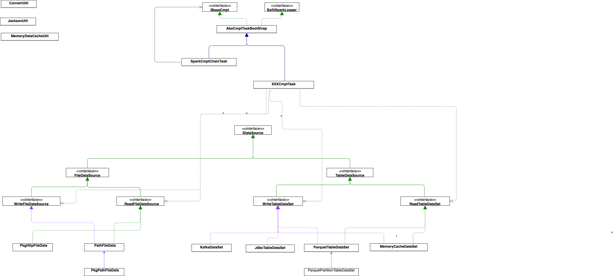

# 批式Spark任务组件

## 代码架构
    
## 数据源介绍

### 已支持数据接口：
 - TableDataSource：DataSet类型的数据
    - ReadTableDataSet：读取DataSet类型的数据
    - WriteTableDataSet：写出DataSet类型的数据
 - FileDataSource：文件类型的数据
     - HashMapFileData: 文件类型的数据内容为HashMap类型的
     - ReadHashMapFileData：读取内容为HashMap类型的文件类型的数据

### 已实现数据源功能

[//]: # ()
[//]: # (#### CcFeatTableDataSet[**data_id=cc_feat_table**])

[//]: # (功能介绍：实现ReadTableDataSet接口，可以读取CC生成的指标纵表和事件表，生成指标宽表；)

[//]: # (##### 使用介绍)

[//]: # (- json方式使用:)

[//]: # (```)

[//]: # ("inputDataExample": {)

[//]: # (   "data_id": "cc_feat_table",)

[//]: # (   "eventPath": "/user/example/inputs/event/",)

[//]: # (   "featPath": "/user/example/inputs/feat/",)

[//]: # (   "joinField": "serial_id")

[//]: # (})

[//]: # (```)

[//]: # (- yaml方式使用:)

[//]: # (```yaml)

[//]: # (inputDataExample:)

[//]: # (   data_id: cc_feat_table)

[//]: # (   eventPath: /user/example/inputs/event/)

[//]: # (   featPath: /user/example/inputs/feat/)

[//]: # (   joinField: serial_id)

[//]: # (```)

#### PkgHttpFileData[**data_id=pkg_http_file**]
   功能介绍：实现ReadHashMapFileData接口，可通过http方式获取PKG包
##### 使用介绍
- json方式使用:
```
"httpPkgFileEx": {
   "data_id": "pkg_http_file",
   "username": "restUser",
   "password": "8ang$un",
   "httpUrl": "http://xx.xx.xxx.xxx/adm/example/inputs/"
}
```
- yaml方式使用:
```yaml
httpPkgFileEx:
   data_id: pkg_http_file
   username: restUser
   password: 8ang$un
   httpUrl: http://xx.xx.xxx.xxx/adm/example/inputs/
   
```

#### JdbcTableDataSet[**data_id=jdbc_table**]
功能介绍：实现WriteTableDataSet接口，可以将dataset数据写出到jdbc类型数据库中；

##### 使用介绍
- json方式使用:
```
"outputDataExample": {
   "data_id": "jdbc_table",
   "dburl": "jdbc:mysql://10.100.2.202:3306/sdm_7190?useSSL=false;useUnicode=true;characterEncoding=UTF-8",
   "dbname": "dom230",
   "dbpassword": "bangsun",
   "dbdriver": "com.mysql.cj.jdbc.Driver",
   "dbtablename": "/user/example/outputs/"
}
```
- yaml方式使用:
```yaml
outputDataExample:
  data_id: jdbc_table
  dburl: jdbc:mysql://10.100.2.202:3306/sdm_7190?useSSL=false;useUnicode=true;characterEncoding=UTF-8
  dbname: dom230
  dbpassword: bangsun
  dbdriver: com.mysql.cj.jdbc.Driver
  dbtablename: /user/example/outputs/
```

#### KafkaDataSet[**data_id=kafka_data**]
功能介绍：实现WriteTableDataSet接口，可以将dataset数据推送到Kafka中；

##### 使用介绍
- json方式使用:
```
"outputDataExample": {
   "data_id": "kafka_data",
   "kafkaServers": "xx.xx.xx.xx:9092",
   "kafkaTopic": "kafka_test_topic",
   "options": ""
}
```
- yaml方式使用:
```yaml
outputDataExample:
   data_id: kafka_data
   kafkaServers: xx.xx.xx.xx:9092
   kafkaTopic: kafka_test_topic
   options: 
```
#### MemoryCacheDataSet[**data_id=memory_cache**]
功能介绍：实现ReadTableDataSet，WriteTableDataSet接口，可以从内存中读取DataSet数据和临时存储，多个组件组合运行时可以用该方式传递数据集；

##### 使用介绍
- json方式使用:
```
"inputMemoryCacheDataSetEx": {
   "data_id": "memory_cache",
   "keyId": "memory_data_key"
},
"outputMemoryCacheDataSetEx": {
   "data_id": "memory_cache",
   "keyId": "memory_data_key"
}
```
- yaml方式使用:
```yaml
inputDataExample:
   data_id: memory_data
   keyId: memory_data_key
   
outputDataExample:
   data_id: memory_data
   keyId: memory_data_key
```


#### ParquetTableDataSet[**data_id=parquet_table**]
功能介绍：实现ReadTableDataSet，WriteTableDataSet接口，可以从Hdfs路径读取parquet数据，也可将dataset存到hdfs中；
##### 使用介绍
- json方式使用:
```
"inputDataExample": {
   "data_id": "parquet_table",
   "path": "/user/example/inputs/"
},
"outputDataExample": {
   "data_id": "parquet_table",
   "path": "/user/example/outputs/"
}
```
- yaml方式使用:
```yaml
inputDataExample:
   data_id: parquet_table
   path: /user/example/inputs/
   
outputDataExample:
   data_id: parquet_table
   path: /user/example/inputs/
```

#### PartitionParquetTableDataSet[**data_id=partition_parquet_table**]
功能介绍：实现ReadTableDataSet，WriteTableDataSet接口，可以从Hdfs路径读取parquet数据，也可将dataset存到hdfs中；
##### 使用介绍
- json方式使用:
```
"inputDataExample": {
   "data_id": "partition_parquet_table",
   "path": "/user/example/inputs/",
   "partitionColumn":["event_code","biz_data"]
},
"outputDataExample": {
   "data_id": "partition_parquet_table",
   "path": "/user/example/outputs/",
   "partitionColumn":["event_code","biz_data"]
}
```
- yaml方式使用:
```yaml
inputDataExample:
   data_id: partition_parquet_table
   path: /user/example/inputs/
   partitionColumn:
      - event_code
      - biz_data

outputDataExample:
   data_id: partition_parquet_table
   path: /user/example/inputs/
   partitionColumn: 
      - event_code
      - biz_data

```

#### PkgPathFileData[**data_id=pkg_path_file**]
   功能介绍：实现ReadHashMapFileData接口，可直接读取hdfs路径中的PKG包
- json方式使用:
```
"pathPkgFileEx": {
   "data_id": "pkg_path_file",
   "path": "/user/example/inputs/pkg"
}
```
- yaml方式使用:
```yaml
httpPkgFileEx:
   data_id: pkg_path_file
   path: /user/example/inputs/pkg
```


## 组件介绍

### 默认实现组件
#### SparkCmptChainTask[**cmpt_id=chain_cmpt**]
功能介绍： 支持多个组件串行运行，通过组件之间的组合实现目标的功能；
##### 使用介绍
- json方式使用:
```
{
    "cmpts": [
        {
            "inputTableDataSet": {
                "data_id": "parquet_path_table",
                "path": "/user/dom/3000/input"
            },
            "cmpt_id": "data_migration",
            "outputDataSet": {
                "data_id": "memory_cache",
                "keyId": "memory_data_set"
            }
        },
        {
            "inputTableDataSet": {
                "data_id": "memory_cache",
                "keyId": "memory_data_set"
            },
            "cmpt_id": "data_migration",
            "outputDataSet": {
                "data_id": "parquet_path_table",
                "path": "/user/dom/3000/output"
            }
        }
    ],
    "cmpt_id": "chain_cmpt"
}
```
- yaml方式使用:
```yaml
rulebacktestingtask:
   cmpt_id: chain_cmpt
   cmpts:
      - cmpt_id: data_migration        #第一个组件ID
        inputTableDataSet:
           data_id: parquet_path_table
           path: /user/dom/3000/input #从该路径读出parquet数据
        outputDataSet:
           data_id: memory_cache  # //建议存放在内存中，便于下个组件使用；
           keyId: memory_data_set #//可自定义名，保持唯一即可
      - cmpt_id: data_migration       #第二个组件ID
        inputTableDataSet:
           data_id: memory_cache
           keyId: memory_data_set #与上一个组件的输出保持一致，即可取出上一个组件存放的数据
        outputDataSet:
           data_id: parquet_path_table
           path: /user/dom/3000/output #数据存放hdfs路径
```