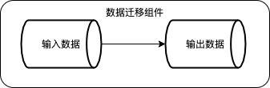

# 扩充数据源与组件开发文档

### DataSet数据源扩充开发：
1. 实现ReadTableDataSet或WriteTableDataSet接口；
2. 定义data_id[**cmpt_id或data_id不可与现存在的重复**];

```java
@Data
public class XXXTableDataSet implements ReadTableDataSet, WriteTableDataSet {
    private String data_id = "数据源唯一标识";
}
```

3. 实现对应读或写方法：

```
/**
* 数据读取
*
* @param SparkSession sparkSession
*/
@Override
public Dataset read(SparkSession sparkSession) {
    return xxx；
}
/**
* 数据存储
*
* @param dataset
* @param saveMode
*/
@Override
public void write(Dataset dataset, SaveMode saveMode) {
    dataset.write().mode(saveMode).option("compression", "snappy").parquet(getPath());
}

@Override
public Boolean validate() {
    //验证方法（可选）
    return true;
}
```

### 新增数据类型接口开发：
1. 新增xxx类型数据接口

```
/**
 * xxx格式的数据
 */
public interface XXXData extends IDataSource {

}
```

2. 新增xxx类型数据的读或写接口

```
/**
 * 读取xxx类型数据
 */
public interface ReadXXXData extends XXXData {
    XXX read();
}
/**
 * 写出xxx类型数据
 */
public interface WriteXXXData extends XXXData {
    XXX write(XXX xxx);
}
```

## 组件介绍

### 已支持组件

- SparkCmptChainTask[**cmpt_id=chain_cmpt**]：链式组件功能，可以将多个组件组合起来一起运行，以达到某些功能，链式组件运行过程，会按照**cmpts**的组件顺序执行：

```
    @Override
    public Object run(SparkSession sparkSession) {
        for (IBaseCmpt absBaseCmpt : cmpts) {
            Object run = absBaseCmpt.run(sparkSession);
        }
        return null;
    }
```

- DataMigrationCmptTask[**cmpt_id=data_migration**]: 数据迁移组件,可以将将数据从一个存储介质上转存到另一存储介质上；

### 新增组件开发：

1. 新建对应XXX组件类，继承抽象类AbsCmptTaskBootStrap；
2. XXX组件类设计cmpt_id[**cmpt_id或data_id不可与现存在的重复**];
3. 按组件的需要增加属性（输入输入输出数据可以使用ReadTableDataSet，WriteTableDataSet）指代；
4. 实现run方法，在run方法中实现，具体组件的具体逻辑；

```
/**
 * 数据迁移组件：将数据从一个存储介质上转存到另一存储介质上
 */
@Data
public class DataMigrationCmptTask extends AbsCmptTaskBootStrap {

    private String cmpt_id = IBaseCmpt.DATA_MIGRATION;

    private ReadTableDataSet inputTableDataSet;//组件的属性1

    private WriteTableDataSet outputDataSet;//组件的属性2

    @Override
    public Object run(SparkSession sparkSession) {
        ReadTableDataSet inputTableDataSet = getInputTableDataSet();
        Dataset dataset = inputTableDataSet.read(sparkSession);
        //组件功能逻辑
        WriteTableDataSet outputDataSet = getOutputDataSet();
        outputDataSet.write(dataset);
        return null;
    }

    @Override
    public Boolean validate() {
        //验证方法
        return true;
    }
}
```

## 使用介绍

### 数据源使用介绍
// todo

### 数据迁移组件
将数据从一个存储介质上转存到另一存储介质上

### 示例组件逻辑


### 数据迁移组件使用示例

```

/**
* 数据迁移组件使用示例
*/
@SneakyThrows
@Test
public void dataMigrationCmptTaskTest(){
    SparkSession.clearActiveSession();
    SparkSession.Builder builder = SparkSession.builder();
    builder = builder.master("local[*]");
    SparkSession sparkSession = builder.enableHiveSupport().getOrCreate();
    String inputdata="src/test/resources/data/input/kafka/9ff4093006634957ac7e374757e9a933/3qe7r7erj2gg/data";
    DataMigrationCmptTask dataMigrationCmptTask = new DataMigrationCmptTask();
    ParquetTableDataSet parquetTableDataSet = new ParquetTableDataSet();
    parquetTableDataSet.setPath(inputdata);
    dataMigrationCmptTask.setInputTableDataSet(parquetTableDataSet);
    KafkaDataSet kafkaDataSet = new KafkaDataSet();
    kafkaDataSet.setKafkaServers("10.100.2.161:9092");
    kafkaDataSet.setKafkaTopic("InternalcontrolRiskArchiveQueue_offline110");
    dataMigrationCmptTask.setOutputDataSet(kafkaDataSet);
    String jsonString = JSONObject.toJSONString(dataMigrationCmptTask);
    System.setProperty("sun.java.command","cn.com.bsfit.spark.framework.DataMigrationCmptTask");
    DataMigrationCmptTask.main(new String[]{"-json",jsonString});
}
```

#### 对应组件json

```json
{
    "cmpt_id": "data_migration",
    "inputTableDataSet": {
        "data_id": "parquet_table",
        "path": "src/test/resources/data/input/kafka/9ff4093006634957ac7e374757e9a933/3qe7r7erj2gg/data"
    },
    "outputDataSet": {
        "data_id": "kafka_data",
        "kafkaServers": "10.100.2.161:9092",
        "kafkaTopic": "InternalcontrolRiskArchiveQueue_offline110"
    }
}
```

### 组合组件运行使用示例

```
/**
    * 组合链组件使用示例
    */
@SneakyThrows
@Test
public void sparkCmptChainTaskTest(){
    SparkSession.clearActiveSession();
    SparkSession.Builder builder = SparkSession.builder();
    builder = builder.master("local[*]");
    SparkSession sparkSession = builder.enableHiveSupport().getOrCreate();
    String inputdata="src/test/resources/data/input/kafka/9ff4093006634957ac7e374757e9a933/3qe7r7erj2gg/data";
    DataMigrationCmptTask dataMigrationCmptTask = new DataMigrationCmptTask();
    ParquetTableDataSet parquetTableDataSet = new ParquetTableDataSet();
    parquetTableDataSet.setPath(inputdata);
    dataMigrationCmptTask.setInputTableDataSet(parquetTableDataSet);
    KafkaDataSet kafkaDataSet = new KafkaDataSet();
    kafkaDataSet.setKafkaServers("10.100.2.161:9092");
    kafkaDataSet.setKafkaTopic("InternalcontrolRiskArchiveQueue_offline110");
    dataMigrationCmptTask.setOutputDataSet(kafkaDataSet);
    SparkCmptChainTask chainTask = SparkCmptChainTask.builder(dataMigrationCmptTask);
    String chainTaskStr = JSONObject.toJSONString(chainTask);
    chainTask.run(sparkSession,chainTaskStr);
}
```

#### 对应组件json

```
[
    {
        "cmpt_id": "data_migration",
        "inputTableDataSet": {
            "data_id": "parquet_table",
            "path": "src/test/resources/data/input/kafka/9ff4093006634957ac7e374757e9a933/3qe7r7erj2gg/data"
        },
        "outputDataSet": {
            "data_id": "kafka_data",
            "kafkaServers": "10.100.2.161:9092",
            "kafkaTopic": "InternalcontrolRiskArchiveQueue_offline110"
        }
    }
]
```